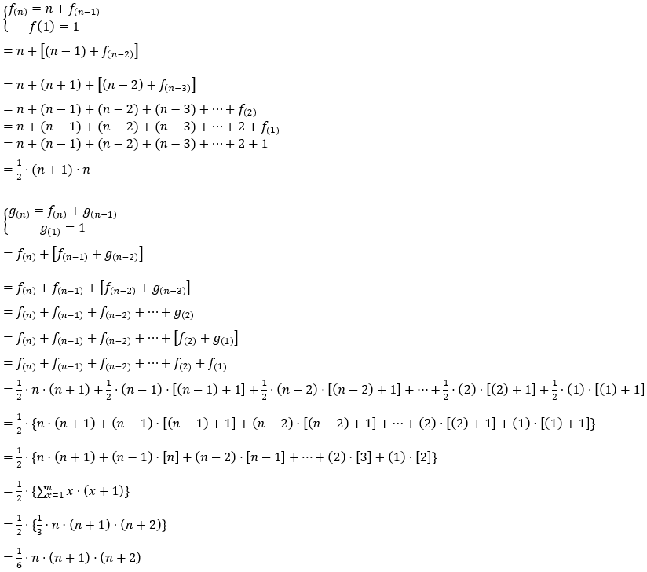

##[a216：數數愛明明](http://zerojudge.tw/ShowProblem?problemid=a216)
======
評分方式：Tolerant 
記憶體限制：512 MB

1. 公開 測資點 (50%): 1.0s , <1K
2. 公開 測資點 (30%): 1.0s , <1K
3. 公開 測資點 (20%): 1.0s , <1K

題目最後更新時間：2012-08-22 12:03 

- - -
* 內容：  
	數數是班上聰明又漂亮的女生，有一天……，她愛上了明明。  
	她對明明說：「我們的愛，若是錯誤，願你我沒有白白受苦。呃，不是，我們的愛就像是函數！」  
	明明說，「是啊，我對妳的愛是與日俱增呢！」  
	數數開心地說，「你的意思是，你在第 n 天對我的愛若用函數 f(n) 來描述，那麼，f(n) = n + f(n-1)。也就是說，每一天都比前一天多了一單位的愛，並且與舊的愛累積起來嗎？」  
	明明點了點頭，然後問，「那麼，妳呢？」  
	數數說，「我在第 n 天對你的愛若是 g(n)，則會滿足 g(n) = f(n) + g(n-1) 關係！」  
	於是，明明笑了笑，摟著數數說，我一定會更加愛妳的！  
	註：在第一天的時候，f(1) = g(1) = 1。

* 輸入說明：  
	輸入以 EOF 結束。每一筆測試資料有一個數字 n，其中 n > 0。  
	此外，50% 的測資 n <= 500；80% 的測資，n <= 3000；全部的測資 n <= 30000。
* 輸出說明：  
	輸出 f(n) 與 g(n)。

- - -
提示：  
	[等差數列與等差級數](https://zh.wikipedia.org/wiki/%E7%AD%89%E5%B7%AE%E6%95%B0%E5%88%97#.E7.AD.89.E5.B7.AE.E4.B8.AD.E9.A0.85)
	[求和符號](https://zh.wikipedia.org/wiki/%E6%B1%82%E5%92%8C%E7%AC%A6%E5%8F%B7#.E6.95.B8.E5.88.97.E6.B1.82.E5.92.8C.E5.85.AC.E5.BC.8F)

標籤：  
	[數列](http://zerojudge.tw/Problems?tag=%E6%95%B8%E5%88%97)
	[數學](http://zerojudge.tw/Problems?tag=%E6%95%B8%E5%AD%B8)

出處：  
	[VacationClub](http://zerojudge.tw/UserStatistic?account=VacationClub)

- - -
###公式推導過程

